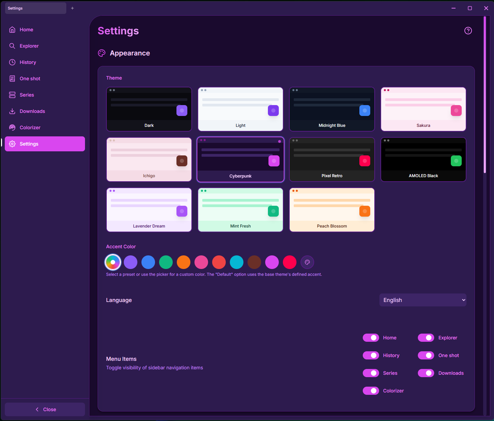

# Manga Visor 📖

A premium desktop manga viewer and downloader. Beautiful, fast, and built for an uninterrupted reading experience.


---

## 🚀 What is Manga Visor?

Manga Visor is a desktop app that lets you browse, read, and download manga from multiple sources. It organizes everything in one place with a modern interface, keyboard shortcuts, and a smooth reading experience.

**Quick start:** Browse your local folders in the Explorer, add manga to your Library, or paste a URL to download directly.

### Key Features

- **📥 Downloader** — Paste a URL and download automatically. Supports 22 sites (see list below).
- **🖼️ Viewer** — Vertical scroll or lateral pages, auto-scroll, zoom & pan, thumbnails view.
- **📂 Explorer** — Browse folders recursively, sort by name/date, drag & drop to reorder.
- **🏛️ Library** — Organize one-shots and series with automatic chapter detection.
- **🎨 Colorizer** — AI-powered colorization for black & white manga (requires Python).
- **📖 Reading History** — Auto-resume where you left off, progress indicators.
- **🎭 9 Themes** — Dark, Light, AMOLED Black, Sakura, and more.
- **🌐 Multi-language** — English and Spanish supported.
- **🔄 Auto-Update** — Silent background updates via GitHub releases. Two channels: Stable (tagged releases) and Dev (latest build).

## 📸 Screenshots



[Screenshots →](screenshots/SCREENSHOTS.md)

<details>
<summary><strong>🌐 Supported Download Sites</strong> (click to expand)</summary>

- Hitomi.la
- MangaDex.org
- nHentai.net · nHentai.xxx · nHentai.com · nHentai.website
- ManhwaWeb.com
- ZonaTMO.com
- Hentaiera.com
- HentaiRead.io
- Hentai2Read.com
- IMHentai.xxx · IMHentai.to
- Hentaivox.com
- Manga18.club
- Comics18.org
- Hentaifc.com
- ComicPorn.xxx
- E-Hentai.org
- Submanhwa.com
- Hentaiforce.net
- lhentai.com
- Hentaifox.com

</details>

---

## 🛠️ Tech Stack

- **Framework**: [Wails v2](https://wails.io/) (Go + Webview)
- **Backend**: Go 1.24 — SQLite via modernc.org/sqlite (pure Go, no CGo)
- **Frontend**: React 18 + TypeScript + Vite
- **Styling**: Tailwind CSS
- **State Management**: Zustand
- **Drag & Drop**: @dnd-kit
- **i18n**: react-i18next

## 🖼️ Native Image Decoding (AVIF & WebP)

Manga Visor uses **forked versions** of the [gen2brain/avif](https://github.com/gen2brain/avif) and [gen2brain/webp](https://github.com/gen2brain/webp) libraries to accelerate AVIF and WebP decoding via native FFI (not WASM).

| Format | Fork | Native library |
|--------|------|----------------|
| **AVIF** | [cristian-guerrero/avif](https://github.com/cristian-guerrero/avif) | `libavif` + `libdav1d` |
| **WebP** | [cristian-guerrero/webp](https://github.com/cristian-guerrero/webp) | `libwebp` + `libwebpdemux` |

### How it works

Both libraries ship with a built-in WASM decoder (slow fallback) and an optional native FFI path that calls the C library via purego. The problem is that `LoadLibrary` / `dlopen` only searches standard system paths, not a custom cache folder.

The forks solve this by intercepting the library's `init()` call via `preloadNative()`:

| Platform | Mechanism |
|----------|-----------|
| **Windows** | `LoadLibraryExW(DLL_LOAD_DIR)` — pre-loads all DLLs from `~/.manga-visor/avif-bin/` and `~/.manga-visor/webp-bin/` resolving all dependencies from the same directory. |
| **Linux** | Sets `LD_LIBRARY_PATH` before `purego.Dlopen` so that `dlopen("libavif.so")` / `dlopen("libwebp.so")` finds the cached copy. |
| **macOS** | No-op (WASM fallback; DYLD_LIBRARY_PATH can be configured if needed). |

This means:
- ✅ No changes to Go's compilation flags (no CGO, no build tags)
- ✅ No permanent PATH modifications
- ✅ All binaries stay inside the app's data directory
- ✅ WASM fallback when native library is not available

### Pre-built binaries

Native libraries are built via CI workflows ([`build-avif-binaries.yml`](.github/workflows/build-avif-binaries.yml), [`build-webp-binaries.yml`](.github/workflows/build-webp-binaries.yml)) and published as GitHub Releases. They are auto-downloaded on first run to:

```
~/.manga-visor/avif-bin/
├── libavif.dll       (Windows) / libavif.so (Linux)
├── libdav1d-7.dll
├── libyuv.dll
├── libsharpyuv-0.dll
└── ... (runtime dependencies)

~/.manga-visor/webp-bin/
├── libwebp.dll       (Windows) / libwebp.so (Linux)
├── libwebpdemux.dll
└── ... (runtime dependencies)
```

## 🚀 Getting Started

### Prerequisites
- [Go 1.24.0](https://golang.org/dl/)
- [Node.js 20+](https://nodejs.org/)
- [Wails CLI](https://wails.io/docs/gettingstarted/installation)

### Development

```bash
# Clone the repository
git clone https://github.com/yourusername/manga-visor.git
cd manga-visor

# The fork is referenced via replace in go.mod:
#   replace github.com/gen2brain/avif v0.4.4 => github.com/cristian-guerrero/avif v0.0.0-...

# Install frontend dependencies
cd frontend && npm install && cd ..

# Run in development mode
wails dev
```

### 📦 Building & Releases
The project uses GitHub Actions for **multiplatform builds**. When a new tag (e.g., `v1.0.5`) is pushed, builds are automatically generated for:
- **Windows** (AMD64)
- **Linux** (AMD64 - requires `libgtk-3-dev` and `libwebkit2gtk-4.1-dev`)
- **macOS** (Universal/Silicon support)

To build manually:
```bash
wails build -platform windows/amd64 -name manga-visor2
```

## 🎮 Keyboard Shortcuts

### Navigation
| Key | Action |
|-----|--------|
| `←` `A` | Previous page |
| `→` `D` `Space` | Next page |
| `Home` | First page |
| `End` | Last page |
| `Escape` | Panic mode / Close viewer / Return to home |

### Viewer Controls
| Key | Action |
|-----|--------|
| `+` `=` | Zoom in |
| `-` | Zoom out |
| `0` | Reset zoom |
| `B` | Toggle sidebar |
| `T` | Toggle Thumbnail view |
| `Ctrl + Wheel` | Adjust vertical width (vertical mode) |

### General
| Key | Action |
|-----|--------|
| `ESC` | Panic button (customizable in settings) |

## 📊 Data Storage

All application state is stored locally at `~/.manga-visor/` (Windows: `%USERPROFILE%\.manga-visor\`). Backend is the single source of truth — no frontend localStorage is used.

### Multi-Library Architecture

Each **library** is a fully self-contained SQLite database (`.db`) with its own settings, themes, library entries, history, tabs, and viewer state. A **JSON registry** (`libraries.json`) tracks which libraries exist and which is active.

```
~/.manga-visor/
├── libraries.json          ← Registry: list of libraries + active library ID
├── manga-visor.db          ← Default library (legacy or freshly created)
├── library__comics.db      ← Additional library (e.g. "Comics")
├── cache/
├── downloads/
└── temp/
```

- **`libraries.json`** — lightweight file storing `{ libraries: [...], activeLibraryId: "..." }`.
  Each library entry has an id, name, filename, and isDefault flag.
- **Each `.db`** — complete SQLite database containing all tables: `settings`,
  `ui_preferences`, `library_entries`, `series_entries`, `history`, `tabs`,
  `viewer_states`, `explorer_folders`, `download_jobs`, etc.
- Settings are per-library: switching libraries also switches themes, sidebar
  visibility, viewer preferences, and all other UI state.
- Creating a new library copies the current library's settings so it starts
  with the same look and feel.

### Folders
- **`avif-bin/`** — Cached native AVIF libraries auto-downloaded from GitHub Releases.
- **`webp-bin/`** — Cached native WebP libraries auto-downloaded from GitHub Releases.
- **`cache/`** — Persistent thumbnail cache.
- **`downloads/`** — Default download location.
- **`temp/`** — Temporary workspace for archive extraction.

### Database Tables
- **`settings`** — Application preferences (theme, language, viewer modes, reading direction, etc.)
- **`explorer_folders`** — User-defined base folders
- **`library_entries`** — One Shot Library entries
- **`series_entries`** / **`series_chapters`** — Series metadata and chapters
- **`history`** — Reading progress
- **`download_jobs`** — Download queue state
- **`tabs`** — Open tab state for session restoration
- **`image_orders`** — Custom image ordering
- **`folder_orders`** — Custom and automatic folder ordering
- **`folder_view_modes`** — Per-directory grid/list preferences
- **`viewer_states`** — Viewer scroll position and page index
- **`ui_preferences`** — Sort modes, sort orders, and view mode preferences

## 📝 License
MIT License - See [LICENSE](LICENSE) for details.

---
Made with ❤️ for the manga community.
